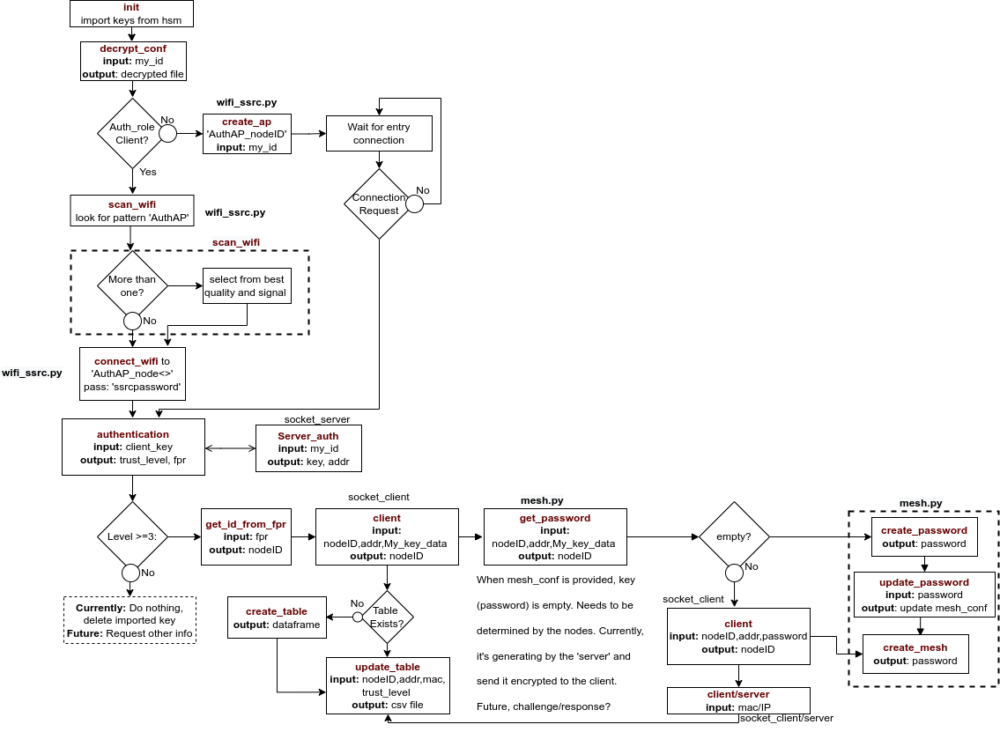

# Node for Mutual Authentication

## Introduction

This code represents the behavior of the node when is trying to connect to the mesh network.

After the certificates are transferred from the provisioning server to the node, the certificates are stored in the hardware security module (HSM).  The node imports the certificates to the program.

The node gets its Identity, public and private keys, as well as the encrypted and signed mesh parameters. 

The next step is to scan for available Access Points with the pattern “AuthAP”. For this, it will be used the wifi code on the utils folder. If there is not any available, the program creates an access point with the pattern “AuthAP_node<ID>". If there is some available AP, the program will check what is the best quality and signal. All the mentioned process is done on the 'wlan0' interface. 

After the connection/creation with the AP, the program starts some server and client sockets to exchange their public keys. Once a key is received, the authenticator verifies its validity (expiration). If the validity is still OK, the program will verify the signatures of the keys. If the trust level is bigger than 3 (Trust Fully), it will be exchanged for the authenticator pub key and the process will be repeated on the receiver side. 

Once both nodes are authenticated by themselves, the mesh will be established. Initially, the provisioning server provides the parameters with an empty password. Thus, it is the function of the authenticator to create a password and shared it with the receiver. For this, the authenticator generates a 10 digits random string (only numbers for WEP, or characters +numbers for WPA), encrypts it with the receiver's pub key, and shared it with it. 

Finally, when all the parameters are ready, another code on utils (mesh.py) will implement the mesh as requested. 
### Protocol 

The following image shows the protocol of the mutual authentication:
 

## Run Program
### Normal Execution 
```
./nodeAuth.py
```

### Cleaning Execution
This will clean all the keys generated as well as the files.

```
./nodeAuth.py -c
```

## Code Flow


## Utils folder
Contains the utils for wifi management [wifi_ssrc.py](utils/wifi_ssrc.py) and for mesh creation and handling [mesh.py](utils/mesh.py) 
