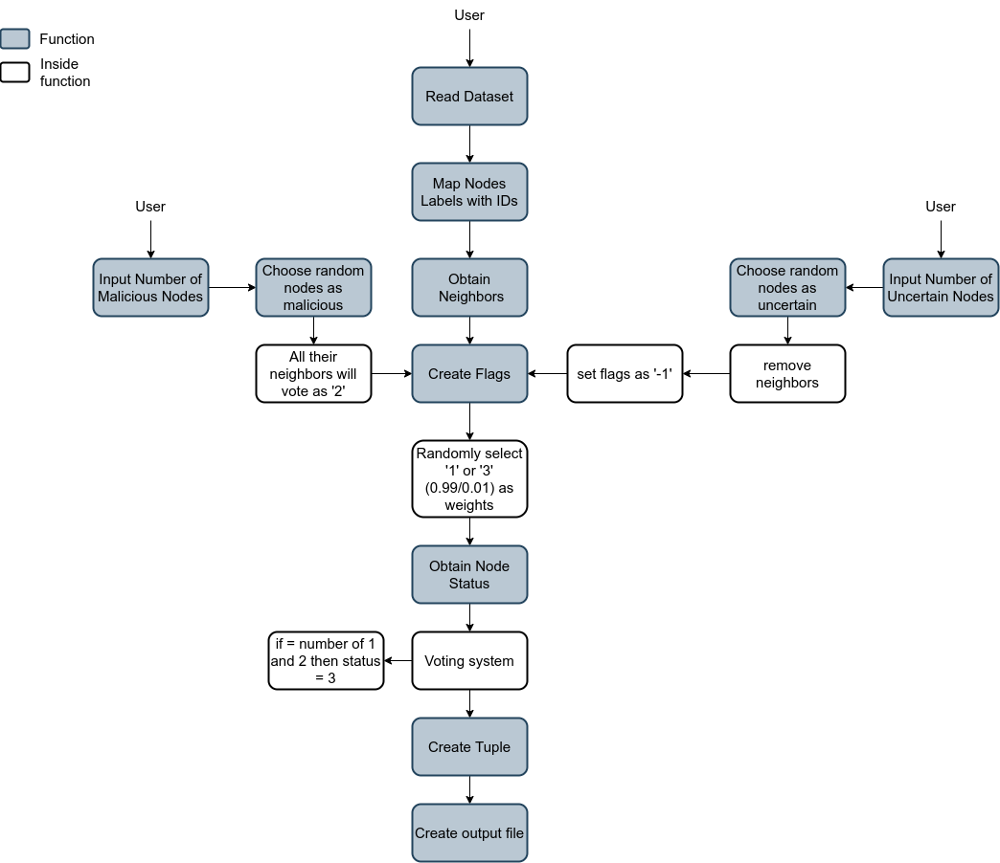
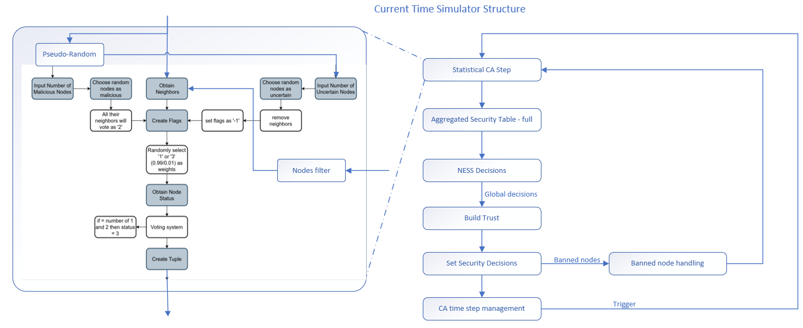

# Data simulator
The main idea of this simulator is to create data as input for the decision engine.

The simulator takes as input a topology dataset (in .gml format) to obtain the neighbors of each node.

## Installing 

`pip3 install -r requirements.txt`

## CA step Standalone Execution

`python3 main.py -d <dataset.gml>`

this execution generates a file called `output.data ` in the same folder of the main.py file. 
This file should be the input of the decision engine (`driver.py`)

The expected output for each node on program should be:

`[node_num, [svr1, svr2, ..., svrk], [flg1, flg2, ..., flgk], status]]`

The following diagram shows the execution of the program:

## Loop Simulator Execution

`python3 main_CA_DE_loop.py -d <dataset.gml>`

This simulator combines the CA step to the DE one and iterates over time based on the decision results. A GUI indicates the nodes status and displays the network topology evolution.

The following diagram shows the execution of the program:

